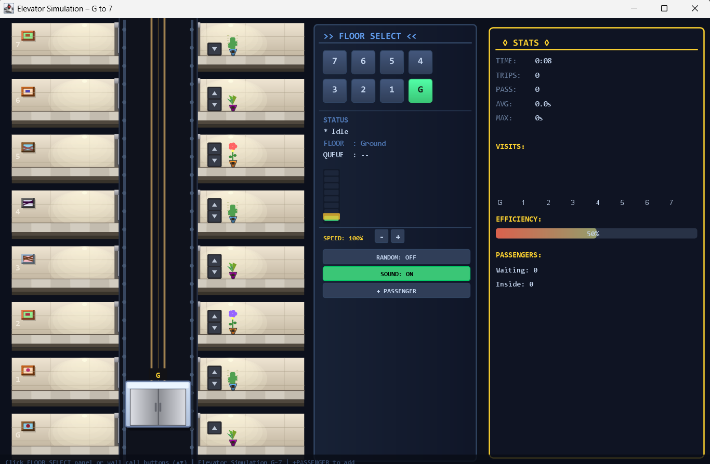
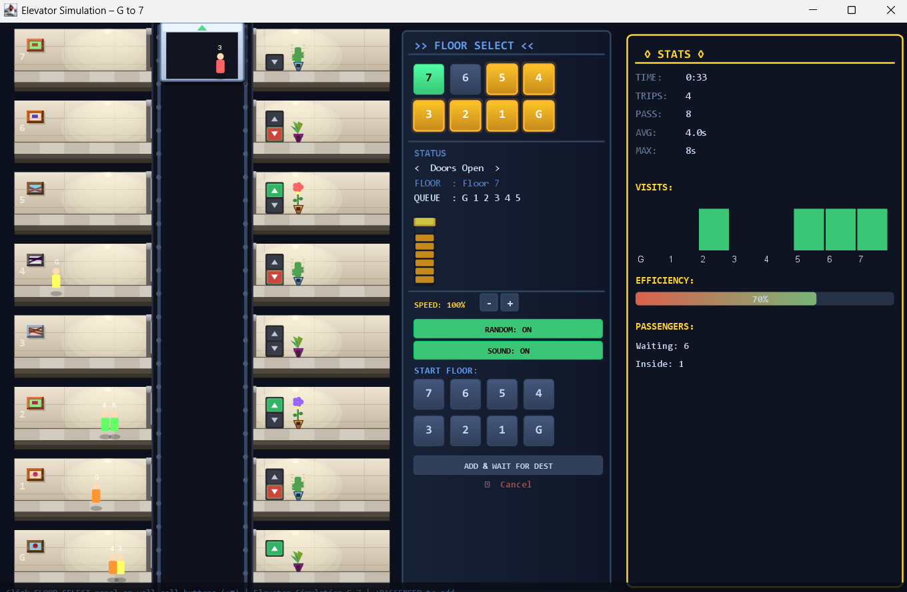

<div align="center">

# Graphics-Design

</div>
Study of creating and manipulating 2D/3D graphics using Python libraries, covering drawing primitives, transformations, animation, and simple interactive visual applications.


<div align="center">

# 🚀 Elevator Simulation 🚀

</div>

## 📸 Preview

### Without Passengers


### With Passengers


A modern **Java Swing Elevator Simulation** featuring animated elevator movement, realistic passenger behavior, sound effects, floor request scheduling, and an interactive GUI dashboard.

This project simulates a multi-floor elevator system with dynamic passenger management, smooth animations, and real-time statistics tracking.

---

# ✨ Features

- 🏢 Multi-floor elevator system (Ground + 7 floors)
- 🎞️ Smooth elevator movement and animated doors
- 👥 Passenger spawning and boarding system
- 🔊 Sound effects for doors and arrival chimes
- 📊 Real-time statistics panel
- 🎮 Interactive floor selection controls
- 🔁 Random passenger generation mode
- ⚡ Adjustable elevator speed
- 🌈 Modern custom-drawn UI using Java Graphics2D
- ✨ Particle effects and screen shake animations

---

# 🛠️ Technologies Used

- ☕ Java
- 🖼️ Java Swing
- 🎨 Java AWT Graphics2D
- 🔉 Java Sound API

---

# 📂 Project Structure

```bash
ElevatorSimulation.java
Images/
├── 1.png
└── 2.png
```

---

# ▶️ How to Run

## 1. Clone the Repository

```bash
git clone https://github.com/ZannatulRaian/elevator-simulation.git
cd elevator-simulation
```

## 2. Compile the Program

```bash
javac ElevatorSimulation.java
```

## 3. Run the Simulation

```bash
java ElevatorSimulation
```

---

# 🎮 Controls

| Action | Description |
|---|---|
| Floor Buttons | Request elevator to a floor |
| Add Passenger | Spawn passengers manually |
| Random Mode | Automatically generate passengers |
| Speed +/- | Adjust simulation speed |
| Sound Toggle | Enable/Disable sound effects |

---

# 🧠 Simulation Logic

The elevator uses a directional scheduling system:

- Continues moving in the current direction while requests exist
- Picks the nearest valid floor in travel direction
- Reverses direction only when no more requests remain

Passenger flow includes:

1. Passenger appears on a floor
2. Elevator receives request
3. Passenger boards when doors open
4. Destination request is added
5. Passenger exits at destination

---

# 📊 Statistics Tracked

- Total elevator trips
- Total passengers served
- Average passenger wait time
- Maximum wait time
- Floor visit frequency

---

# 🎨 UI Highlights

The simulation includes fully custom-rendered visuals:

- Elevator shaft and cabin
- Animated sliding doors
- Lobby environments
- Passenger avatars
- Floor LEDs and indicators
- Dynamic lighting and gradients

---

# 🔮 Possible Future Improvements

- Multiple elevators
- Emergency/fire mode
- Elevator capacity limits
- AI-based scheduling algorithms
- Different building configurations
- Save/load simulation state
- Networked multi-user simulation

---

# 📚 Learning Objectives

This project demonstrates concepts related to:

- Object-Oriented Programming (OOP)
- Event-driven programming
- GUI development with Swing
- Animation loops and timers
- State management
- Simulation systems
- Queue and scheduling algorithms

---


# 📄 License

This project is open source and available under the MIT License.
